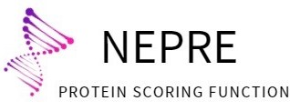
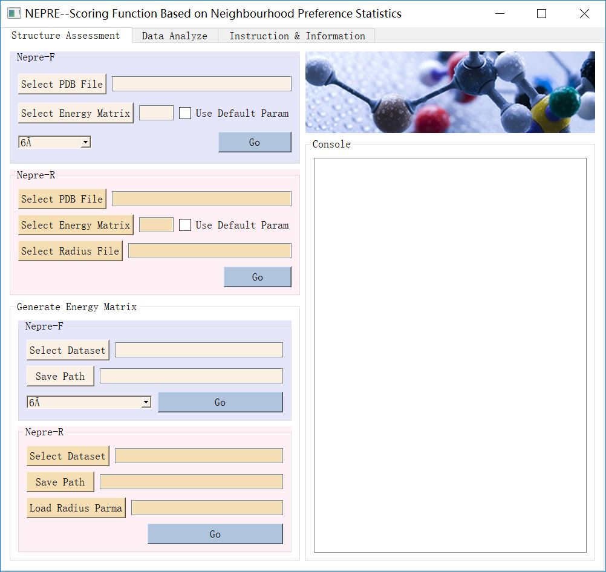

[LiuLab]() | [Article]() | [WebServer]() | [Code Package]() | [Executable Program]()

Introduction
---------------
An executable program for NEPRE.  

CopyRight
-------------
**Nepre** is created by **LiuLab** of **Beijing Computation Science Research Center(CSRC)**.

Environment
-------------
* Microsoft Windows 10/8/7
* Linux

Contact Us
-------------
**Email**: nepre2018@163.com  
**Address**: Building 9, East Zone, ZPark II, No.10 East Xibeiwang Road, Haidian District, Beijing 100193, China.

Others
-------------

Logo通过<a href="https://www.designevo.com/cn/" title="免费在线logo制作软件">DesignEvo</a>设计制作

